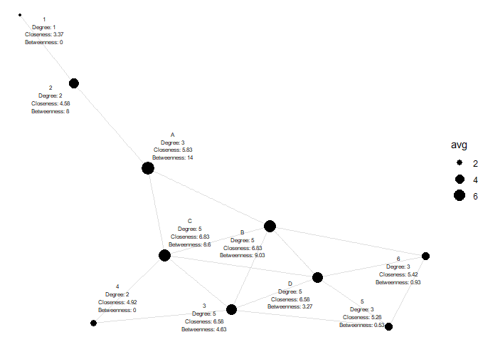

## Network

## Discussion

There appears to be 2 approaches to developing the most useful informal
networks based on our discussion in class

1.  Be at the center of a dense network
2.  Be an intermediary between various networks

The first approach can be defined by the degree score and for the first
approach B would likely be the best (as it has the highest other scores)
The second approach can be defined by betweenness score and for this
approach A would be best

It seems to me that the 1st approach would result in closer friendships,
whereas 2nd approach would result in many acquaintances Due to that I
would go with 1st approach as making friends is more important for me
than having many acquaintances who can help with career

## Code

    ### CREATE DATA
    nodes <- tibble(name = c('1', '2', '3', '4', '5', '6','A', 'B', 'C', 'D'))
    edges <- tibble(
      from = c('6','6','6', '5', '5', '4', '4', '3', '2', '2', 'D', 'D', 'B', 'B', 'C', '3', '3'),
      to = c('5','D','B', 'D', '3', '3', 'C', 'D', '1', 'A', 'B', 'C', 'C', 'A', 'A', 'C', 'B')
    )

    ### CREATE NETWORK
    network <- tbl_graph(nodes = nodes, edges = edges, directed=FALSE)

    ### ESTIMATE METRICS
    network <- network %>% 
      mutate(degree = centrality_degree(),
             closeness = centrality_closeness_harmonic(),
             betweenness = centrality_betweenness()) %>%
      mutate(avg = (degree + closeness + betweenness)/3) %>%
      mutate(label = paste0(name, '\n',
                            'Degree: ',round(degree,2), '\n',
                            'Closeness: ',round(closeness,2), '\n',
                            'Betweenness: ',round(betweenness,2), '\n'))
    node_data <- network %>% data.frame() %>% tibble()

    plot <- network %>%
      ggraph(layout="graphopt") +
      geom_edge_link(edge_colour = "grey", alpha=0.5) +
      geom_node_point(aes(size=avg)) +
      geom_node_text(aes(label = label), size=2, repel=TRUE) +
      theme_void()
