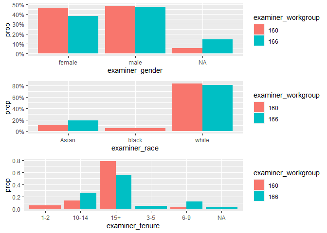
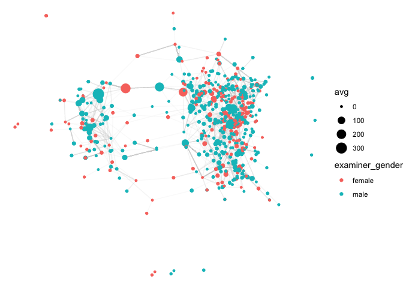

## Summary Statistics

Workgroups 216 and 179 are evaluated. Workgroup 216 has 302 employees,
and 179 has 829. Workgroup 216 is more male dominated with 73.5% vs
62.8% for 179. Both workgroup are mostly white and asian employees. With
179 having almost 80% white employees vs 60% for 216. Workgroup 216
generally has employees who worked less than 179

<table>
<caption>Gender Distribution</caption>
<thead>
<tr class="header">
<th style="text-align: left;">examiner_workgroup</th>
<th style="text-align: right;">female</th>
<th style="text-align: right;">male</th>
</tr>
</thead>
<tbody>
<tr class="odd">
<td style="text-align: left;">179</td>
<td style="text-align: right;">37.15</td>
<td style="text-align: right;">62.85</td>
</tr>
<tr class="even">
<td style="text-align: left;">216</td>
<td style="text-align: right;">26.49</td>
<td style="text-align: right;">73.51</td>
</tr>
</tbody>
</table>

Gender Distribution

<table>
<caption>Race Distribution</caption>
<thead>
<tr class="header">
<th style="text-align: left;">examiner_workgroup</th>
<th style="text-align: right;">Asian</th>
<th style="text-align: right;">black</th>
<th style="text-align: right;">Hispanic</th>
<th style="text-align: right;">other</th>
<th style="text-align: right;">white</th>
</tr>
</thead>
<tbody>
<tr class="odd">
<td style="text-align: left;">179</td>
<td style="text-align: right;">18.70</td>
<td style="text-align: right;">2.29</td>
<td style="text-align: right;">2.17</td>
<td style="text-align: right;">0.12</td>
<td style="text-align: right;">76.72</td>
</tr>
<tr class="even">
<td style="text-align: left;">216</td>
<td style="text-align: right;">30.79</td>
<td style="text-align: right;">4.64</td>
<td style="text-align: right;">3.64</td>
<td style="text-align: right;">NA</td>
<td style="text-align: right;">60.93</td>
</tr>
</tbody>
</table>

Race Distribution

<table>
<caption>Tenure Distribution</caption>
<thead>
<tr class="header">
<th style="text-align: left;">examiner_workgroup</th>
<th style="text-align: right;">10-14</th>
<th style="text-align: right;">15+</th>
<th style="text-align: right;">3-5</th>
<th style="text-align: right;">6-9</th>
<th style="text-align: right;">&lt;1</th>
<th style="text-align: right;">1-2</th>
</tr>
</thead>
<tbody>
<tr class="odd">
<td style="text-align: left;">179</td>
<td style="text-align: right;">37.52</td>
<td style="text-align: right;">54.40</td>
<td style="text-align: right;">5.07</td>
<td style="text-align: right;">3.02</td>
<td style="text-align: right;">NA</td>
<td style="text-align: right;">NA</td>
</tr>
<tr class="even">
<td style="text-align: left;">216</td>
<td style="text-align: right;">33.11</td>
<td style="text-align: right;">42.38</td>
<td style="text-align: right;">11.59</td>
<td style="text-align: right;">8.61</td>
<td style="text-align: right;">0.33</td>
<td style="text-align: right;">3.97</td>
</tr>
</tbody>
</table>

Tenure Distribution

    ## Warning: The dot-dot notation (`..prop..`) was deprecated in ggplot2 3.4.0.
    ## ℹ Please use `after_stat(prop)` instead.

## Network Visualization

There appears to be two distinct clusters. These clusters are likely
base on workgroup however. Within each of the 2 clusters however there
doesn’t appear any segregation by gender or by race. This could be due
to the non-dominant groups being too small to form their own cluster. Or
it could be because the employees are interested in maintaining diverse
groups.

    ## Warning: Using the `size` aesthetic in this geom was deprecated in ggplot2 3.4.0.
    ## ℹ Please use `linewidth` in the `default_aes` field and elsewhere instead.

## Discussion

<table>
<caption>Gender Centrality Scores</caption>
<thead>
<tr class="header">
<th style="text-align: left;">examiner_gender</th>
<th style="text-align: right;">top10_degree</th>
<th style="text-align: right;">top10_bet</th>
<th style="text-align: right;">mean_degree</th>
<th style="text-align: right;">mean_bet</th>
</tr>
</thead>
<tbody>
<tr class="odd">
<td style="text-align: left;">female</td>
<td style="text-align: right;">30.78947</td>
<td style="text-align: right;">74.14260</td>
<td style="text-align: right;">5.010417</td>
<td style="text-align: right;">7.985249</td>
</tr>
<tr class="even">
<td style="text-align: left;">male</td>
<td style="text-align: right;">32.53191</td>
<td style="text-align: right;">82.60917</td>
<td style="text-align: right;">5.674641</td>
<td style="text-align: right;">8.894336</td>
</tr>
</tbody>
</table>

Gender Centrality Scores

<table>
<caption>Race Centrality Scores</caption>
<thead>
<tr class="header">
<th style="text-align: left;">examiner_race</th>
<th style="text-align: right;">top10_degree</th>
<th style="text-align: right;">top10_bet</th>
<th style="text-align: right;">mean_degree</th>
<th style="text-align: right;">mean_bet</th>
</tr>
</thead>
<tbody>
<tr class="odd">
<td style="text-align: left;">Asian</td>
<td style="text-align: right;">24.46154</td>
<td style="text-align: right;">161.73846</td>
<td style="text-align: right;">4.352941</td>
<td style="text-align: right;">15.92577</td>
</tr>
<tr class="even">
<td style="text-align: left;">black</td>
<td style="text-align: right;">60.00000</td>
<td style="text-align: right;">5.00000</td>
<td style="text-align: right;">7.222222</td>
<td style="text-align: right;">0.50000</td>
</tr>
<tr class="odd">
<td style="text-align: left;">Hispanic</td>
<td style="text-align: right;">45.00000</td>
<td style="text-align: right;">0.00000</td>
<td style="text-align: right;">7.000000</td>
<td style="text-align: right;">0.00000</td>
</tr>
<tr class="even">
<td style="text-align: left;">white</td>
<td style="text-align: right;">35.15556</td>
<td style="text-align: right;">67.25883</td>
<td style="text-align: right;">5.686230</td>
<td style="text-align: right;">6.94378</td>
</tr>
</tbody>
</table>

Race Centrality Scores

## Code

    ### LOAD DATA
    applications <- read_parquet(here('assignments','assignment_3',"app_data_clean.parquet"))
    edges <- read_csv(here('assignments','assignment_3',"edges_sample.csv"))

    ### CLEAN DATA
    applications <- applications %>%
      select(-c('gender.y', 'race.y')) %>% 
      rename(gender = gender.x, race = race.x) %>%
      mutate(tenure_years = tenure_days / 365) %>%
      mutate(tenure = case_when(
        tenure_years <= 1 ~ '<1',
        tenure_years <= 2 ~ '1-2',
        tenure_years <= 5 ~ '3-5',
        tenure_years <= 9 ~ '6-9',
        tenure_years <= 14 ~ '10-14',
        tenure_years <= 100 ~ '15+',
        TRUE ~ NA_character_
      ))
      

    ### WORKGROUPS
    applications <- applications %>% 
      mutate(examiner_workgroup = str_sub(examiner_art_unit, 1, -2))

    ### DROP NAs
    applications <- applications %>% drop_na(gender, tenure, race)

    ### EXAMINER DATA
    examiner_data <- applications %>%
      distinct(examiner_id, examiner_gender = gender, 
               examiner_race = race, examiner_tenure = tenure) 

    ### WORKGROUPS
    examiner_subset <- applications %>% 
      filter(examiner_workgroup %in% c(216, 179)) %>%
      distinct(examiner_id, examiner_workgroup) %>%
      left_join(examiner_data, by='examiner_id')
      

    ### COMPARE WORKGROUPS (STATISTICS)
    t_gend <- examiner_subset %>% count(examiner_workgroup, examiner_gender) %>%
      group_by(examiner_workgroup) %>% mutate(freq = n / sum(n) * 100) %>%
      select(examiner_workgroup, examiner_gender, freq) %>% 
      mutate(freq = round(freq, 2)) %>%
      pivot_wider(names_from = examiner_gender, values_from = freq)
    t_race <- examiner_subset %>% count(examiner_workgroup, examiner_race) %>%
      group_by(examiner_workgroup) %>% mutate(freq = n / sum(n) * 100) %>%
      select(examiner_workgroup, examiner_race, freq) %>% 
      mutate(freq = round(freq, 2)) %>%
      pivot_wider(names_from = examiner_race, values_from = freq)
    t_tenure <- examiner_subset %>% count(examiner_workgroup, examiner_tenure) %>%
      group_by(examiner_workgroup) %>% mutate(freq = n / sum(n) * 100) %>%
      mutate(freq = round(freq, 2)) %>%
      select(examiner_workgroup, examiner_tenure, freq) %>% 
      pivot_wider(names_from = examiner_tenure, values_from = freq)

    ### COMPARE WORKGROUPS (PLOTS)
    p_gend <- ggplot(examiner_subset, aes(x=examiner_gender, y=..prop.., 
                                          fill=examiner_workgroup, 
                                          group=examiner_workgroup)) +
      geom_bar(aes(), stat='count', position='dodge') +
      scale_y_continuous(labels = scales::percent_format())
    p_race <- ggplot(examiner_subset, aes(x=examiner_race, y=..prop.., 
                                          fill=examiner_workgroup, 
                                          group=examiner_workgroup)) +
      geom_bar(aes(), stat='count', position='dodge') +
      scale_y_continuous(labels = scales::percent_format())
    p_tenure <- ggplot(examiner_subset, aes(x=examiner_tenure, y=..prop.., 
                                            fill=examiner_workgroup, 
                                            group=examiner_workgroup)) +
      geom_bar(aes(), stat='count', position='dodge')

    ### CREATE NETWORK
    edge_subset <- edges %>% 
      filter(ego_examiner_id %in% examiner_subset$examiner_id &
               alter_examiner_id %in% examiner_subset$examiner_id) %>%
      drop_na() %>% 
      select(to = ego_examiner_id, from = alter_examiner_id)
    node_subset <- edge_subset %>% 
      pivot_longer(cols=c('from','to')) %>% 
      distinct(examiner_id = value) %>%
      left_join(examiner_data, on='examiner_id') %>%
      distinct(examiner_id, examiner_gender, examiner_race, examiner_tenure) %>%
      rename(name = examiner_id) %>%
      mutate(name = as.character(name))
    network <- graph_from_data_frame(edge_subset, directed = TRUE) %>%
      as_tbl_graph() %>%
      left_join(node_subset, by='name')

    ### ESTIMATE METRICS
    network <- network %>%
      mutate(degree = centrality_degree(),
             betweenness = centrality_betweenness()) %>%
      mutate(avg = (degree + betweenness)/2) %>%
      mutate(label = paste0(name, '\n',
                            'Degree: ',round(degree,2), '\n',
                            'Betweenness: ',round(betweenness,2), '\n',
                            'Avg: ',round(avg,2)))

    ### PLOT NETWORK
    set.seed(1)
    net_gender <- network %>%
      ggraph(layout="mds") +
      geom_edge_link(edge_colour = "#d3d3d3", alpha=0.1) +
      geom_node_point(aes(color=examiner_gender, size=avg)) +
      theme_void()
    set.seed(1)
    net_race <- network %>%
      ggraph(layout="mds") +
      geom_edge_link(edge_colour = "#d3d3d3", alpha=0.1) +
      geom_node_point(aes(color=examiner_race, size=avg)) +
      theme_void()

    ### DISCUSSION
    network_data <- network %>% as.data.frame() %>% as.tibble()

    disc_gend_mean <- network_data %>% 
      group_by(examiner_gender) %>%
      summarize(mean_degree = mean(degree), 
                mean_bet = mean(betweenness))
    disc_gend_top_degree <- network_data %>% 
      arrange(desc(degree)) %>%
      group_by(examiner_gender) %>%
      top_frac(0.1, degree) %>%
      summarize(top10_degree = mean(degree))
    disc_gend_top_bet <- network_data %>% 
      arrange(desc(betweenness)) %>%
      group_by(examiner_gender) %>%
      top_frac(0.1, betweenness) %>%
      summarize(top10_bet = mean(betweenness))
    disc_gend_top <- disc_gend_top_degree %>% 
      left_join(disc_gend_top_bet, on='examiner_gender')
    disc_gend <- disc_gend_top %>% 
      left_join(disc_gend_mean, on='examiner_gender')

    disc_race_mean <- network_data %>% 
      group_by(examiner_race) %>%
      summarize(mean_degree = mean(degree), 
                mean_bet = mean(betweenness))
    disc_race_top_degree <- network_data %>% 
      arrange(desc(degree)) %>%
      group_by(examiner_race) %>%
      top_frac(0.1, degree) %>%
      summarize(top10_degree = mean(degree))
    disc_race_top_bet <- network_data %>% 
      arrange(desc(betweenness)) %>%
      group_by(examiner_race) %>%
      top_frac(0.1, betweenness) %>%
      summarize(top10_bet = mean(betweenness))

    disc_race_top <- disc_race_top_degree %>% 
      left_join(disc_race_top_bet, on='examiner_race')
    disc_race <- disc_race_top %>% 
      left_join(disc_race_mean, on='examiner_race')
